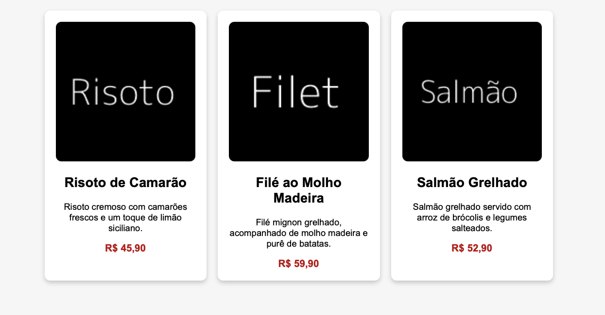

# 📌 ATIVIDADE 01 - Criando um Cardápio

💡 **Objetivo:**  
Você deve construir uma página web simples com um **cardápio de restaurante fictício**, organizando os itens do cardápio utilizando o CSS. Para isso, você vai usar propriedades como **border, width e height** para estruturar o layout de forma adequada.

🎯 **Antes de começar:**

1. Faça o clone do repositório na pasta desejada.
2. Acesse a pasta clonada.
3. Crie uma nova branch e a acesse diretamente com `git checkout -b seu-nome`.
4. Abra o Visual Studio Code a partir da pasta clonada.

---

## 🎯 **Instruções:**

1. Criar um arquivo **index.html** e um **style.css**.
2. Construir uma estrutura HTML com:
   - Um **cabeçalho** (h1) para o nome do restaurante.
   - Um **container principal** que conterá os pratos.
   - Três **cards de pratos**, cada um contendo:
     - Uma **imagem** do prato.
     - Um **título** (h2) com o nome do prato.
     - Uma **descrição curta** do prato.
     - Um **preço** formatado corretamente.
3. Aplicar estilos no **style.css**, utilizando:
   - `padding`, `margin` e `border` para espaçamento e organização.
   - `width` e `height` para definir tamanhos adequados.
   - `display: block` ou `display: inline` para alinhar os cards.
  
> Dica: você pode criar imagens aleatórias com o link `https://dummyimage.com`. Por exemplo: o link `https://dummyimage.com/150x150/000/fff&text=Teste` cria uma imagem 150x150px, preta com texto branco e "Teste" escrito nela.

Sua página deverá ser semelhante ao apresentado na imagem abaixo.

---

### 📌 **Desafios Extras (para aprofundar a prática)**

- ✅ Adicionar **hover effects** nos cards para criar uma interação visual quando o usuário passa o mouse.
- ✅ Utilizar **border-radius** para criar bordas arredondadas.
- ✅ Utilizar **box-shadow** para criar um design atraente com a aplicação de sombras.

---

🎯 **Preparando a sua entrega:**

1. Salve todos os arquivos.
2. Verifique os arquivos com `git status` (os arquivos devem estar em vermelho).
3. Adicione os arquivos na área de staging (`git add .`).
4. Faça o commit com `git commit -m "nome do commit`.
5. Envie o commit para o repositório remoto com `git push -u origin seu-nome`.